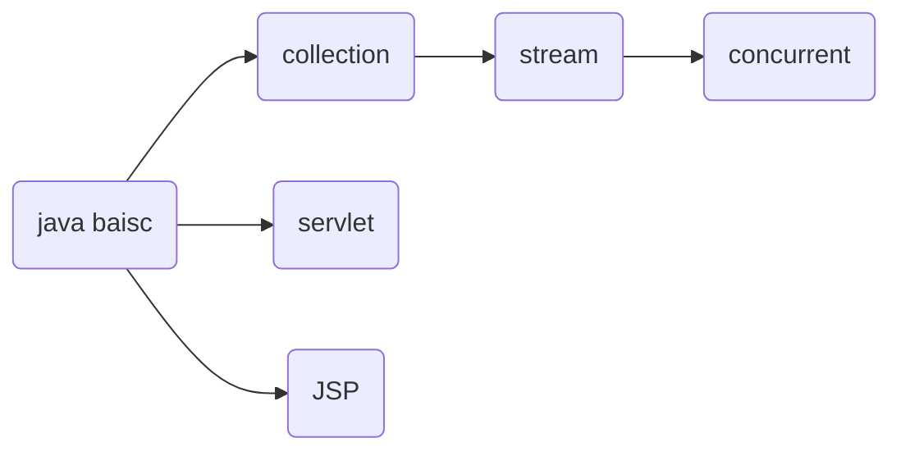

# demo-basic
Practice java basic skills and basic api

[how to use mermaid](https://mermaid-js.github.io/mermaid/#/flowchart)

```mermaid
graph LR
 n1(java baisc) --> n2(collection)
 n2 --> n3(stream)
 n3 --> n4(concurrent)
 n1 --> n9(servlet)
 
 n1 --> J1(JSP)

 
```
